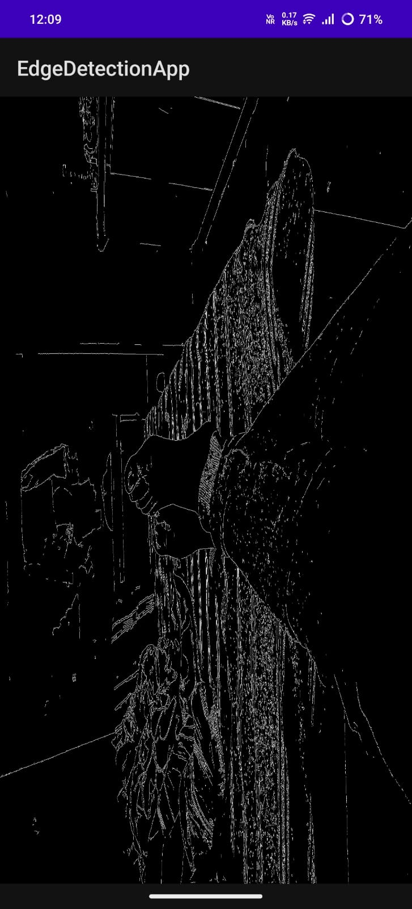
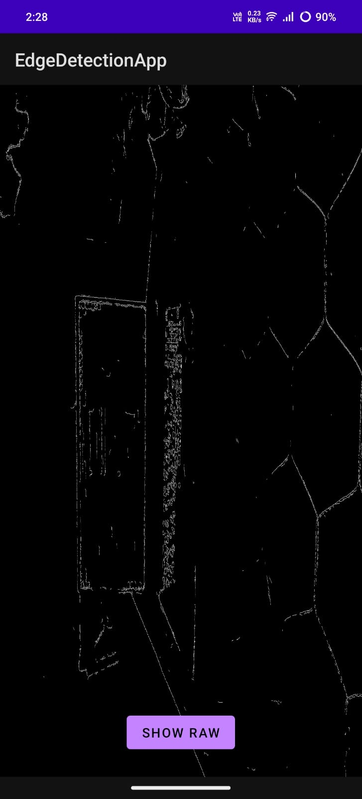
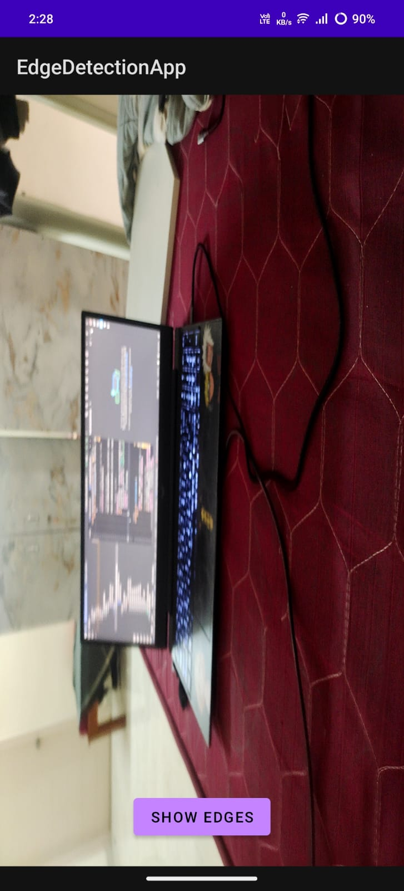
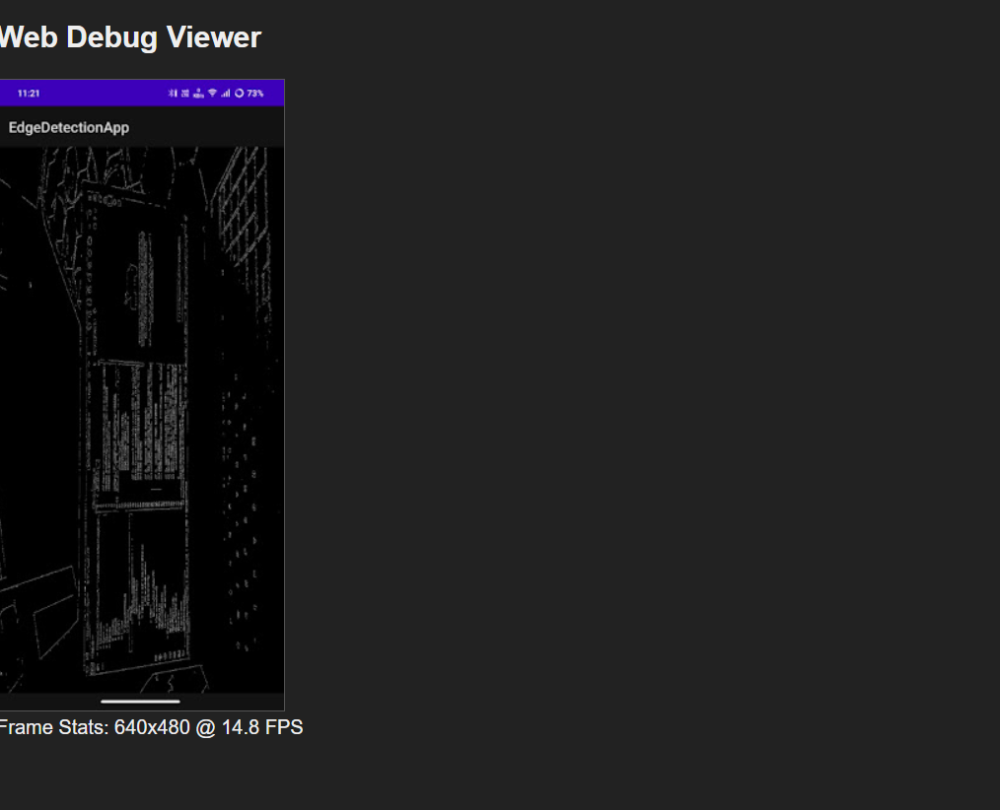

# Software Engineering Intern - R&D Assignment
**(Real-Time Edge Detection Viewer)**

This project is a native Android application that performs real-time Canny edge detection on the live camera feed. It uses a combination of Android SDK (Kotlin), NDK (C++), OpenCV, and OpenGL ES 2.0.

It also includes a minimal TypeScript-based web viewer to demonstrate front-end and build-tool proficiency.

---

##  Features Implemented

### Android Application
* **Camera Feed:** Captures the live camera feed using the Camera1 API.
* **JNI Bridge:** Passes raw camera frame data (NV21 byte array) from Kotlin to C++ efficiently.
* **C++ OpenCV Processing:** The native C++ layer uses OpenCV to:
    1.  Convert the YUV camera frame to Grayscale.
    2.  Apply `cv::Canny` for edge detection.
    3.  Convert the 1-channel Canny output to a 4-channel RGBA texture.
* **OpenGL ES 2.0 Rendering:** The processed RGBA frame is returned to Kotlin and uploaded to an OpenGL texture, rendering the processed video in real-time.

### Web Viewer
* **TypeScript:** A minimal web project built with TypeScript, configured for browser use.
* **Static Frame:** Displays a static, pre-processed "dummy frame" (an example of the Canny output) on an HTML canvas.
* **Frame Stats:** Uses TypeScript to update the DOM and display mock frame statistics (resolution and FPS).

---

##  Bonus Features
I also implemented the following optional features:

1.  **Toggle Button:** A button on the Android UI allows toggling the view between the **raw camera feed** (full color) and the **Canny edge-detected output**.
2.  **FPS Counter:** The application logs the real-time processing and rendering FPS to the Android Logcat, tagged with `EdgeDetectionApp`.

---

##  Application Screenshots

<div align="center">
    <h3>Android Application</h3>
    <p>Toggling between Canny Edge Detection and the Raw camera feed.</p>
    
    &nbsp;&nbsp;&nbsp;
    
    <br/><br/>
    <em>(Add your third screenshot description here, or just add the image)</em>
    <br/>
    
</div>
<br/>
<div align="center">
    <h3>Web Viewer</h3>
    <p>Static debug viewer built with TypeScript.</p>
    
</div>

---
---

##  Setup and Build Instructions

1.  **Clone the Repository:**
    ```bash
    git clone [https://github.com/mikey-harsh/Android-OpenCV-Intern-Challenge.git](https://github.com/mikey-harsh/Android-OpenCV-Intern-Challenge.git)
    ```

2.  **NDK (Native):**
    * This project uses the standard NDK included with Android Studio.
    * The `CMakeLists.txt` is pre-configured.
    * **OpenCV:** The project includes the OpenCV 4.x Android SDK in the `/app/sdk` folder. The `CMakeLists.txt` file automatically links against these pre-built libraries.

3.  **Build Android App:**
    * Open the project in Android Studio.
    * Let Gradle sync and build the project.
    * Run on an Android device (or emulator).

4.  **Build Web Viewer:**
    * Navigate to the `/web` directory.
    * Install dependencies: `npm install`
    * Compile TypeScript: `npx tsc`
    * (Optional) Run a local server: `npx http-server` and open `http://127.0.0.1:8080`.

---

##  Project Architecture

The flow of data in the Android application is as follows:

1.  **`CameraGLRenderer.kt`:** A `Camera.PreviewCallback` receives the raw camera frame as a `byte[]` in NV21 format.
2.  **`MainActivity.kt`:** The `byte[]` is passed to a `static external` JNI function: `processFrame(...)`. A separate JNI function `setProcessingMode(...)` is used to tell the C++ layer whether to process or pass through.
3.  **`native-lib.cpp` (JNI):** This C++ function receives the `jbyteArray` and frame dimensions.
4.  **`native-lib.cpp` (OpenCV):**
    * A `cv::Mat` is created, wrapping the `jbyteArray` (no copy).
    * **If Mode == Edges:**
        * `cv::cvtColor` converts the `YUV_NV21` Mat to Grayscale.
        * `cv::Canny` is run on the Grayscale Mat.
        * `cv::cvtColor` converts the final Canny Mat (Grayscale) to `RGBA`.
    * **If Mode == Raw:**
        * `cv::cvtColor` converts the `YUV_NV21` Mat directly to `RGBA`.
5.  **`CameraGLRenderer.kt`:**
    * The JNI function returns the processed `byte[]` (now in RGBA format).
    * In `onDrawFrame`, `GLES20.glTexImage2D` uploads this byte array to a standard 2D texture.
    * A simple shader program draws this texture to a full-screen quad.